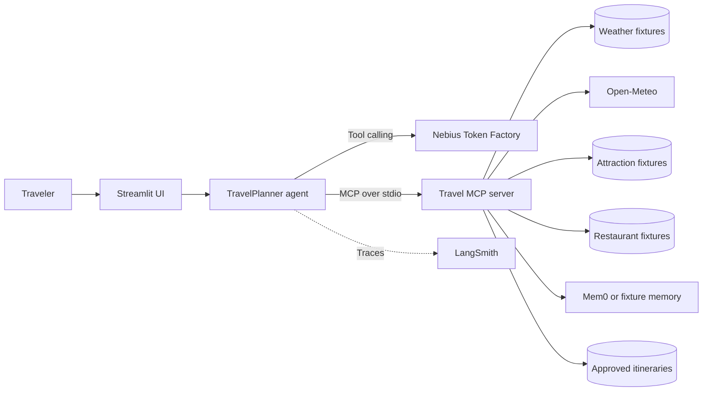

# Travel Day Planner

Travel Day Planner is a single-agent Python application that builds grounded day-trip plans through a Streamlit chat interface. It combines Nebius Token Factory inference, MCP tools, optional Mem0 traveler memory, LangSmith tracing and evaluation, and deterministic travel fixtures.

The application has three independent operating modes:

- `LLM_MODE`: `fake` or `live`
- `MEMORY_MODE`: `fake` or `live`
- `TRAVEL_DATA_MODE`: `fixture` or `live`

The default configuration uses a live LLM, live memory, and fixture travel data. The Streamlit sidebar can change these modes independently for the current session.

## Architecture



The agent discovers MCP tool schemas at runtime. Its reason-act-observe loop is limited to eight turns, rejects repeated identical calls, validates tool results, and applies authorization rules before memory or file mutations.

## Capabilities

- Weather lookup from deterministic fixtures or live Open-Meteo data
- Fixture-based attraction search and attraction details
- Fixture-based restaurant lookup with dietary filtering
- User-scoped traveler preference search, storage, listing, and deletion
- Markdown itinerary saving after explicit approval
- LangSmith tracing and seven-score evaluation reports

Attractions and restaurants remain limited fixture datasets. They are never presented as comprehensive or current live listings.

## Requirements

- Python 3.11 or newer
- [`uv`](https://docs.astral.sh/uv/) recommended
- Nebius API key and tool-capable model identifier for live LLM mode
- Mem0 Platform API key for live memory mode
- LangSmith API key only when tracing or hosted evaluation is required

## Setup

```bash
git clone <repository-url>
cd TravelPlanner
uv sync --python 3.11
cp .env.example .env
```

Configure `.env` as needed:

```dotenv
NEBIUS_API_KEY=
NEBIUS_BASE_URL=https://api.tokenfactory.nebius.com/v1/
NEBIUS_MODEL=

LLM_MODE=live
MEMORY_MODE=live
TRAVEL_DATA_MODE=fixture

MEM0_API_KEY=

LANGSMITH_API_KEY=
LANGSMITH_TRACING=true
LANGSMITH_PROJECT=TravelPlanner
LANGSMITH_ENDPOINT=https://api.smith.langchain.com

APP_ENV=development
MAX_AGENT_STEPS=8
FAKE_MEMORY_DB=output/fake_memories.sqlite3
TRAVEL_FIXTURE_ID=default-v1
```

Never commit `.env` or place credentials in application code. `NEBIUS_MODEL` must identify a Nebius model that supports OpenAI-compatible function calling.

### Operating modes

| Setting | Fixture/fake behavior | Live behavior |
|---|---|---|
| `LLM_MODE` | Deterministic local model | Nebius Token Factory |
| `MEMORY_MODE` | User-scoped SQLite memory | Mem0 Platform |
| `TRAVEL_DATA_MODE` | Checked-in weather fixtures | Open-Meteo weather |

Attraction and restaurant lookup remains fixture-based when live weather is selected. The UI labels this limitation explicitly.

`APP_ENV=test`, `evaluation`, or `deterministic` forces offline-safe fixture behavior. Automated tests never call Nebius, Mem0, Open-Meteo, or LangSmith.

## Run the application

```bash
uv run streamlit run app.py
```

Open `http://localhost:8501`. The interface contains Chat, Memories, and About tabs. Evaluation runs from the command line rather than from Streamlit.

To inspect the MCP server directly:

```bash
APP_ENV=test uv run python -m src.mcp_server
```

## MCP tools

The server exposes nine tools:

| Tool | Purpose |
|---|---|
| `get_weather` | Fixture or Open-Meteo weather lookup |
| `find_attractions` | Fixture attraction category search |
| `get_attraction_details` | Details for a named fixture attraction |
| `search_restaurants` | Fixture restaurant and dietary search |
| `search_traveler_memory` | Search user-scoped preferences |
| `save_traveler_memory` | Save an approved durable preference |
| `list_traveler_memories` | List memories for one user |
| `delete_traveler_memory` | Delete an explicitly selected memory |
| `save_itinerary` | Save an approved Markdown itinerary |

All MCP responses use a structured success or error envelope. Fixture responses identify their source and never claim to be live data.

## Safety behavior

- Memory operations are scoped by `user_id`.
- Durable preference writes require an explicit “remember” request.
- Temporary trip facts, tool output, prompts, secrets, health data, and inferred sensitive information are not eligible for memory storage.
- Memory deletion requires an explicit forget or delete request.
- Itinerary saving requires a separate, explicit approval request.
- Saved plans are restricted to `output/plans/<user-id>/`.
- Absolute paths, traversal, unsafe filenames, and unapproved overwrites are rejected.
- Tool and memory content is treated as untrusted evidence.
- Secrets are redacted before tracing or UI error display.

## Travel fixtures

Deterministic travel data lives in:

- `data/weather_fixtures.json`
- `data/attractions.json`
- `data/restaurant_fixtures.json`

Fixture weather includes the cities and dates required by the golden evaluation dataset, including Boston, Chicago, Kathmandu, and San Francisco. Missing records return structured limitations rather than fabricated results.

Live weather first geocodes a location through Open-Meteo and then requests its forecast. The client applies timeouts, bounded retries, validation, timezone-aware current-date handling, and structured errors.

## Tests

Run the complete offline-safe suite and lint checks:

```bash
APP_ENV=test uv run pytest -q
uv run ruff check .
```

The suite covers the agent loop, compound intents, runtime modes, MCP tools, weather, fixtures, memory policy, Mem0 adaptation, path safety, tracing, Streamlit, and evaluation reporting. Network guards prevent deterministic tests from calling live providers.

## Golden-dataset evaluation

The canonical dataset is `evals/TravelPlanner_golden_dataset_v2_100.csv`. It contains 100 happy-path, edge, controlled-failure, and adversarial cases with isolated users, fixture IDs, tool expectations, structured statuses, and answer assertions.

Validate fixtures and upload the dataset:

```bash
uv run python -m evals.validate_fixtures \
  --csv evals/TravelPlanner_golden_dataset_v2_100.csv
uv run python -m evals.upload_csv_dataset
```

Run the deterministic baseline:

```bash
uv run python -m evals.run_evaluation \
  --mode deterministic \
  --memory-mode fake \
  --dataset-name memory-travel-agent-golden-v2 \
  --experiment-prefix travelplanner-baseline-compact-v2 \
  --output-prefix baseline
```

Run Nebius and Mem0 against fixture travel data:

```bash
uv run python -m evals.run_evaluation \
  --mode live \
  --memory-mode live \
  --dataset-name memory-travel-agent-golden-v2 \
  --max-concurrency 1 \
  --experiment-prefix travelplanner-nebius-mem0-fixture-golden-v2 \
  --output-prefix live-nebius-mem0-fixture
```

Live Mem0 evaluation uses isolated case namespaces and removes only records created by each case. It remains sequential because provider cleanup is task-local. Travel data is always forced to fixture mode for golden evaluation.

### Evaluation output

LangSmith receives exactly seven custom feedback keys:

- `task_completion`
- `tool_trajectory`
- `memory_behavior`
- `grounded_response`
- `safety_compliance`
- `error_recovery`
- `safe_completion`

Detailed subchecks and operational measurements remain in JSON reports. Generated files under `evals/results/` include:

- `<prefix>-summary.json` — aggregate and operational results
- `<prefix>-cases.jsonl` — authoritative per-case technical details
- `<prefix>-review.csv` — seven-column human review view
- `<prefix>-failure-analysis.md` — grouped failure summary

A raw LangSmith export can include additional system columns; the project-generated review CSV always has exactly seven columns.

## Project structure

```text
app.py                         Streamlit application
src/agent.py                   Agent loop and authorization
src/mcp_client.py              MCP stdio client
src/mcp_server.py              Tool server and provider adapters
src/nebius_client.py           Live and deterministic model clients
src/memory_policy.py           Memory eligibility policy
src/weather.py                 Open-Meteo client
data/                          Deterministic travel fixtures
evals/                         Dataset, fixtures, evaluators, and runners
evals/results/                 Generated evaluation reports
tests/                         Offline-safe automated tests
```

## Troubleshooting

- **Live LLM unavailable:** set `NEBIUS_API_KEY` and a tool-capable `NEBIUS_MODEL`.
- **Live memory unavailable:** set `MEM0_API_KEY`, or select Fixture memory in the sidebar.
- **No LangSmith data:** confirm the API key, workspace access, tracing configuration, and quota. The evaluator verifies the uploaded root-run count.
- **Fixture city missing:** fixture mode supports only records checked into the corresponding JSON file.
- **Live weather unavailable:** verify network access and retry after Open-Meteo recovers.
- **MCP startup fails:** run `APP_ENV=test uv run python -m src.mcp_server` and inspect stderr.
- **Itinerary already exists:** choose a new `.md` filename; overwrite requires explicit approval where supported.

## Disclaimer

This project is intended for educational planning and evaluation. Confirm weather, opening hours, accessibility, transportation, and reservations with authoritative sources before travel.
